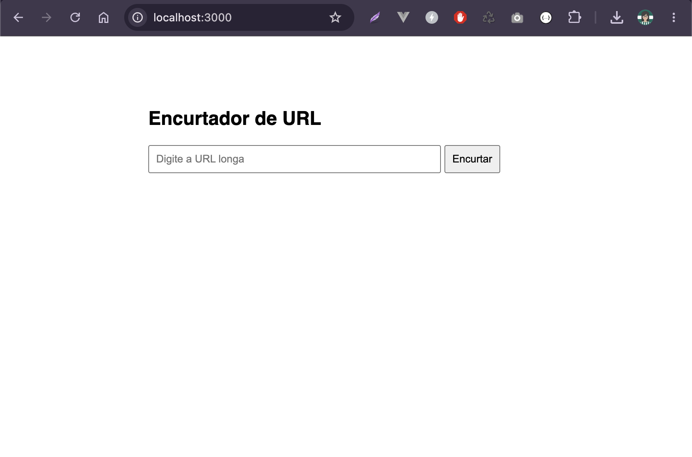

# URL Shortener Performance Lab

This repository is a hands-on lab to measure and improve URL shortener performance using:

- Database indexing (PostgreSQL)
- Connection pooling (Node.js + `pg`)
- External cache (Redis)

Load tests are executed with `k6` against the redirect endpoint.

## Goal

Reproduce a bottleneck scenario first, then apply optimizations in phases and compare metrics (`http_req_duration`, `p95`, checks, and throughput).

## Stack

- Node.js (`express`, `pg`, `redis`)
- PostgreSQL 15
- Redis 7
- Docker Compose
- k6

## Project Structure

```txt
.
├── backend/
│   ├── src/
│   │   ├── server.js
│   │   └── index.html
│   ├── package.json
│   └── Dockerfile
├── db/
│   └── init.sql
├── k6/
│   └── load-test.js
└── docker-compose.yml
```

## Data Seed

On first PostgreSQL startup, `db/init.sql` is executed automatically via `/docker-entrypoint-initdb.d/`.

It creates table `urls` and inserts:

- 150,000 random rows (to encourage sequential scan behavior without index)
- 1 known record at the end: `nu9999 -> https://nubank.com.br`

This key is the target used in load tests.

## Main HTML Page

A simple page is served by the backend to manually submit long URLs.

<p align="center">
  <a></a>
</p>

## Prerequisites

- Docker + Docker Compose
- k6 installed locally

macOS (Homebrew):

```sh
brew install k6
```

## Run the Lab

### 1) Baseline: No index, no pooling, no cache

Default app flags in `docker-compose.yml`:

- `ENABLE_POOLING=false`
- `ENABLE_CACHE=false`

Start everything:

```sh
docker-compose up --build -d
```

Optional seed verification:

```sh
docker exec -it shortener-db psql -U user_admin -d shortener_db -c "SELECT COUNT(*) FROM urls;"
```

Run load test:

```sh
k6 run k6/load-test.js
```

### 2) Add database index

Create index on lookup column:

```sh
docker exec -it shortener-db psql -U user_admin -d shortener_db -c "CREATE INDEX idx_urls_short_url ON urls(short_url);"
```

Run the same test again:

```sh
k6 run k6/load-test.js
```

### 3) Enable connection pooling

Set in `docker-compose.yml`:

- `ENABLE_POOLING=true`

Restart app container:

```sh
docker-compose up -d app
```

Run the test again:

```sh
k6 run k6/load-test.js
```

### 4) Enable Redis cache

Set in `docker-compose.yml`:

- `ENABLE_CACHE=true`

Restart app container:

```sh
docker-compose up -d app
```

Run the test again:

```sh
k6 run k6/load-test.js
```

## k6 Scenario

`k6/load-test.js` runs:

- `50` virtual users
- `30s` duration
- requests to `GET http://localhost:3000/nu9999`

Checks:

- status is `200` or `302`
- response time under `200ms`

## Results

### Phase 1

| Metrics   |    1m    |
|-----------|----------|
| min       | 59.47ms  |
| avg       | 321.77ms |
| med       | 266.84ms |
| max       | 1.06s    |
| p(90)     | 579.48ms |
| p(95)     | 646.58ms |
| req/s     | 118      |
| http fail | 0%       |
| status ok | ✅ 100%  |
| <200ms    | ❌ 30%   |

> **Note:** Sequential Scan is possible the bottleneck: a p95 of 647ms to find 1 row out of 1 million.

### Phase 2

| Metrics   |  Phase 1 |  Phase 2  | Improve |
|-----------|----------|-----------|---------|
| min       | 59.47ms  | 4.28ms    | -93%  | 
| avg       | 321.77ms | 46.08ms   | -86%  |
| med       | 266.84ms | 41.63ms   | -84%  |
| max       | 1.06s    | 210ms     | -80%  |
| p(90)     | 579.48ms | 66.5ms    | -89%  |
| p(95)     | 646.58ms | 75.92ms   | -88%  |
| req/s     | 118      | 341       | +189% |
| http fail | 0%       | 0%        | -     |
| status ok | ✅ 100%  | ✅ 100%    | -     |
| <200ms    | ❌ 30%   | 99.7%     | -     |

> **Note**: Almost 100% of the requests responded in under 200ms. \
\
  *The metric reduced the p95 from 647ms to 76ms (an 88% drop). \
  *Throughput jumped from 118 to 341 req/s (almost 3x higher). \
  *99.7% of requests respond in under 200ms — only 44 out of 20k exceeded this.

**This proves how a simple adjustment can solve a large part of the problem. The Sequential Scan was indeed the dominant bottleneck of Phase 1. With the index, Postgres goes directly to the record and responds in ~4ms.**

### Phase 3

| Metrics   |  Phase 1 |  Phase 2  |  Phase 2  | Improve vs F2 |
|-----------|----------|-----------|-----------|---------|
| min       | 59.47ms  | 4.28ms    | 380µs   | -91%  | 
| avg       | 321.77ms | 46.08ms   | 5.14ms  | -89%  |
| med       | 266.84ms | 41.63ms   | 4.5ms   | -89%  |
| max       | 1.06s    | 210ms     | 105ms   | -50%  |
| p(90)     | 579.48ms | 66.5ms    | 8.26ms  | -88%  |
| p(95)     | 646.58ms | 75.92ms   | 10.29ms | -86%  |
| req/s     | 118      | 341       | 474     | +39%  |
| http fail | 0%       | 0%        | 0%      | -     |
| status ok | ✅ 100%  | ✅ 100%   | ✅ 100%  | -     |
| <200ms    | ❌ 30%   | 99.7%     | 100% ✅  | -     |

> **Note**: Pooling eliminated reconnection overhead. With the pool reusing connections: \
\
  *The median dropped from 42ms → 4.5ms (89% drop) \
  *The p95 dropped from 76ms to 10ms (an 86% drop) \
  *100% of requests under 200ms

### Phase 4

| Metrics   |  Phase 1  | Phase 2   | Phase 3    |   Phase 4  |
|-----------|-----------|-----------|------------|------------| 
| avg       | 380.07ms  | 471.19ms  | 449.22ms   | 4.78ms     | 
| med       | 256.17ms  | 268.98ms  | 99.63ms ✅ | 4.44ms     | 
| min       | 24.1ms    | 5.09ms    | 572µs ✅   |            | 
| max       | 3.21s     | 2.24s     | 2.62s      | 20.81ms    | 
| p(90)     | 702.69ms  | 1.11s     | 1.09s      | 7.41ms     | 
| p(95)     | 1.26s     | 1.25s     | 1.21s      | 8.99ms     | 
| req/s     | 180.4     | 94.2      | 98.7       | 476        |
| fail req  | ✅ 0%     | ✅ 0%      | ✅ 0%      | ✅ 0%      | 
| status ok | 100%      | 100%      | 100%       | 100%       |
| <200ms    | ❌ 30%    | 99.7%     | 100% ✅     | 100% ✅    |

> **The result for Phase 3 was virtually identical to that of Phase 4 with caching**. Hypothesis: the `sleep(0.1)` between iterations for each VU allows time for the pool to reuse connections, minimizing contention. \
\
  *If this applied to the real world, caching with Redis would be over-engineering at this moment. \
  *Perhaps a test with a higher volume of requests and database records could lead to a scenario where an external cache is a suitable solution.

## Author

| [<br /><sub><b>@laisfrigerio</b></sub>](https://github.com/laisfrigerio)<br /> |
| :--------------------------------------------------------------------------------------------------------------------------------------------------------------------------------: |

## License

This project is licensed under the MIT License. See `LICENSE` for details.
